[toc]
# 1 Summary
TTSWAP (token-token swap) is a decentralized automated market-making protocol built on the Ethereum blockchain. Its underlying principle is based on the transfer of market value triggered by user behavior, and it constructs a platform using value conservation trading strategies.
The whitepaper explains the design logic of the ttswap project, covering principles and implementations of good trading, investment, and withdrawal of value goods, as well as ordinary good investment and withdrawal, and the generation and distribution of good transaction fees.

---
# 2 Features
Value Conservation Trading Strategy
The value conservation trading strategy accurately reflects the true market value of currencies and facilitates fast good transactions.

1. Direct Trading without Intermediaries
On this platform, any two types of items can be directly traded without the need for intermediate conversions.

2. No Slippage within Trading Threshold
Transactions below the good trading threshold incur no slippage.

3. No Impermanent Loss for Liquidity Providers or good Investors
Constant market value inherently prevents impermanent loss. When users withdraw their investment, they receive the original invested good plus profits generated from providing liquidity.

4. Low Gas Fees with Simple Computational Logic
The logic behind the constant value trading model is simple, resulting in low computational load and gas consumption.

5. Fee Distribution Based on Roles for Everyone
Fees are distributed based on roles, allowing anyone to become a good investor (liquidity provider), merchant, portal, referrer, user, or platform role, sharing in the platform's growth earnings.
---

# 3 Principle of Value Conservation Trading Mode
## 3.1 Goods
Example: There are 2000 units of good A1 in the market, with a market value of 2000.
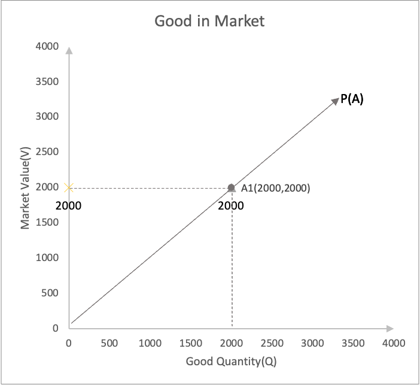
Definition:
Market value V(A1): Used to measure the degree of demand for goods in the market. The market value of good A is 2000.
Quantity Q(A1): Records the quantity of goods. The quantity of good A is 2000.
Unit value P(A1): The market value per unit quantity. The unit value of good A is 1.
## 3.2 The Relationship between Market goods and User Buying and Selling Behavior
* Example 1: The user spends a value of 1000 to purchase good A.
The demand for good A in the market increases. V(A1) = 2000 + 1000 = 3000.
The quantity of good A in the market decreases. Q(A1) = 2000 - 1000 = 1000.
The unit value of good A in the market changes. P(A1) = 3.
* Example 2: The user sells good A for a value of 1000.
The demand for good A in the market decreases. V(A2) = 2000 - 1000 = 1000.
The quantity of good A in the market increases. Q(A2) = 2000 + 1000 = 3000.
The unit value of good A in the market changes. P(A2) = 0.3333.

Display as shown in the following diagram

## 3.3 The relationship between user behavior and good status in the market
Now, as users sell and purchase, the market value V and quantity Q of goods change, causing corresponding changes in the good prices. The changes in market value V and quantity Q of goods are depicted in the graph
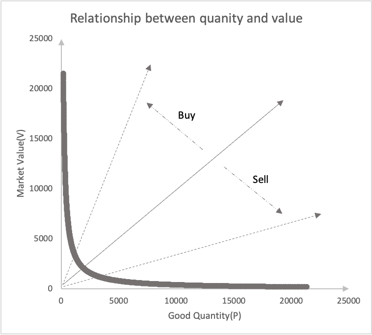

## 3.4 The relationship between two types of items in the market
Now in the market, there are two types of goods, A and B. A(2000, 4000), B(4000, 2000).

When users use 500 units of good A, the corresponding market value is 1000. The market value of 1000 corresponds to 1000 units of good B.
When users use 500 units of good A, they can purchase 1000 units of good B. In the graph below, A will move to position A1, and B will move to position B1.
When users sell 500 units of good A, they will obtain 1000 units of good B. In the graph below, A will move to position A2, and B will move to position B2.
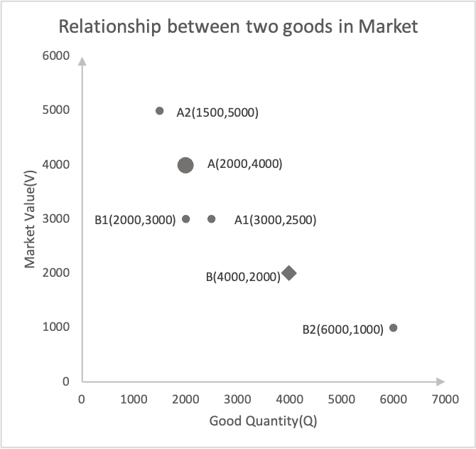
Due to the change in position, P(A) and P(B) also change. The relative price of good B to good A will also change. If there is a discrepancy with the external market price, other transactions will facilitate the convergence of market price with the external market price.
>Note: If the proportion of purchase quantity in the market data is too large, it will cause significant fluctuations in the relative prices of the two goods. Therefore, each transaction will be split into multiple smaller orders for trading.
## 3.5 The relationship between multiple goods in the market
User transactions cause changes in the positions of any two goods, which in turn affect the positions of these two goods relative to other goods, resulting in synchronized price changes.
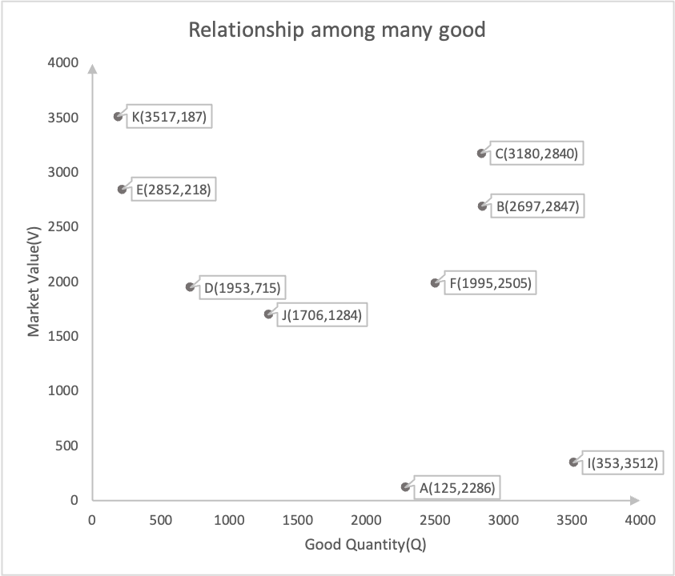
## 3.6 The relationship between transaction size and price of goods in the market
User transactions cause changes in the positions of any two goods, which in turn affect the positions of these two goods relative to other goods, resulting in synchronized price changes.
 | Transaction size | price change   |
 | ---------------- | -------------- |
 | 10               | 0.000000200000 |
 | 50               | 0.000001000000 |
 | 100              | 0.000002000002 |
 | 500              | 0.000010000050 |
 | 1000             | 0.000020000200 |
 | 5000             | 0.000100005000 |
 | 10000            | 0.000200020002 |
 | 50000            | 0.001000500250 |
 | 100000           | 0.002002002002 |
 | 500000           | 0.010050251256 |
 | 1000000          | 0.020202020202 |
 | 5000000          | 0.105263157895 |

## 3.7 No impermanent threshold
To prevent the platform's goods from being squeezed out by user transactions, each good is assigned a segmentation number during initialization. Each unit size corresponds to the non-slippage threshold of the good. Therefore, when users transact, if the transaction value is smaller than the non-slippage threshold of the good, there is no impermanent loss. If the transaction exceeds the non-slippage threshold of the good, the transaction will be split into units based on the threshold for execution.

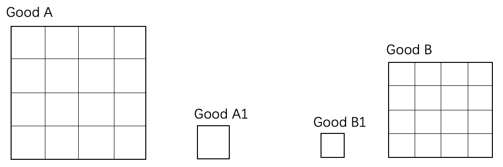

---

# 4 Good
## 4.1 Good introduce
Description of the good: The platform possesses 15 units of good A with a market value of 3000. Thus, the good has two attributes: market value and quantity. See the diagram below.
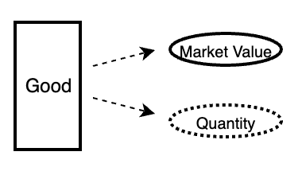
* Noun explanations:
Market value: Records the true market value of goods in the market. When users purchase goods, the market value of the good increases. When users sell goods, the market value of the good decreases.
Quantity: Records the current quantity of goods in the market.

- This can be described for any other good as shown in the diagram below.

## 4.2 Good type
| type       | introduce                                                                     | Does the transaction incur any fees? | Can invest self alone | Can invest self alone with value good |
| ---------- | ----------------------------------------------------------------------------- | ------------------------------------ | --------------------- | ------------------------------------- |
| metagood   | first good  in  market                                                        | yes                                  | yes                   | no                                    |
| valuegood  | The product is recognized by the market,  with a good ecosystem and team. | yes                                  | yes                   | no                                    |
| normalgood | Adding new items, Market value to be confirmed                            | yes                                  | No                    | yes                                   |
## 4.3 Good Config
- The item configuration occupies 255 positions.

### 4.3.1 Market set
| id  | config    | size | unit    | max | min | start | end | note |
| --- | --------- | ---- | ------- | --- | --- | ----- | --- | ---- |
| 1   | valuegood | 1    | BOOLEAN | 1   | 0   | 256   | 256 |      |
| ... |
 
### 4.3.2 Good seller set
| id  | config             | size | unit               | max  | min | start | end | note           |
| --- | ------------------ | ---- | ------------------ | ---- | --- | ----- | --- | -------------- |
| 1   | invest fee rate    | 10   | One ten-thousandth | 1023 | 0   | 255   | 246 | (1~1023)/10000 |
| 2   | disinvest fee rate | 10   | One ten-thousandth | 1023 | 0   | 245   | 236 | (1~1023)/10000 |
| 3   | buy fee rate       | 10   | One ten-thousandth | 1023 | 0   | 235   | 226 | (1~1023)/10000 |
| 4   | sell fee rate      | 10   | One ten-thousandth | 1023 | 0   | 225   | 216 | (1~1023)/10000 |
| 5   | trade chips        | 10   | 64                 | 1023 | 0   | 215   | 206 | (1~1023)X64    |
| 6   | disinvest chips    | 10   | 1                  | 1023 | 0   | 205   | 195 | (1~1023)       |

---

# 5 Swap Good

The essence of good exchange is essentially when users exchange good A in the market for good B. By giving up good A, users demonstrate a decrease in the market value of good A. Users only abandon good A when its market value declines. Conversely, users purchase good B when its market value increases.
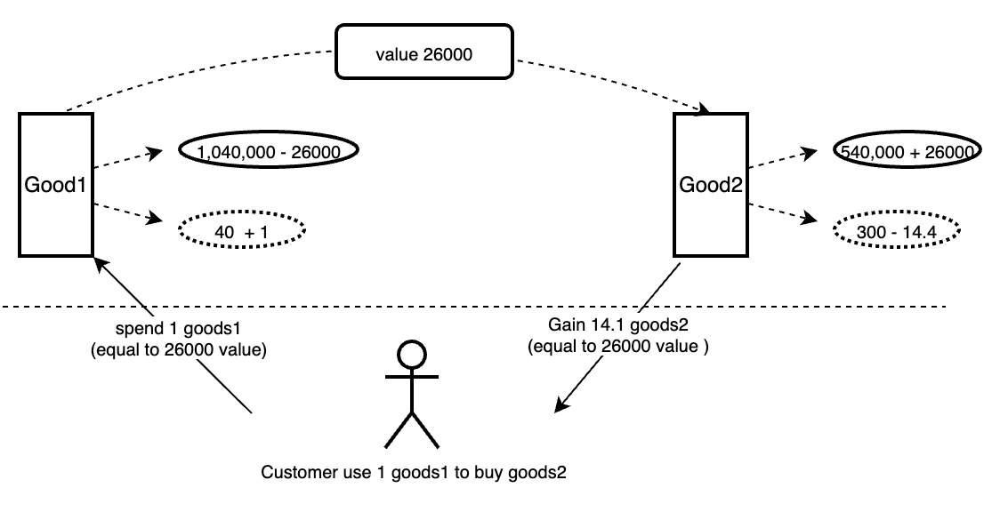
- As shown in the diagram, when users abandon good A, it leads to an increase in the quantity of good A in the platform and a decrease in its market value. Meanwhile, users acquire good B, resulting in a decrease in the quantity of good B in the platform and an increase in its market value. Consequently, the price relative to good A and good B decreases. In subsequent transactions, the same quantity of good A can only purchase a slightly smaller quantity of good B compared to the previous transaction.
- 
As shown in the diagram, we also adhere to the three fundamental principles of market value conservation in trading:

1. The market value of the goods used by users during purchase equals the market value of the goods they acquire.
2. The total market value of the goods held by users before purchase equals the total market value of all goods they hold after purchase.
3. User purchases and sales only result in the transfer of market value from one good to another; it does not disappear.

---

# 6 Invest or disinvest good
## 6.1 Record invest data
In market good trading, liquidity must be provided by someone. It is necessary to record the total market value of good investments and the total quantity of investments.
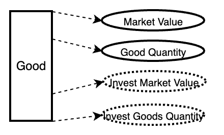
* Noun explanations:
Investment value: Records the total market value of goods when users invest.
Investment quantity: Records the total quantity of goods invested by users.
## 6.2 Invest or disinvest value good
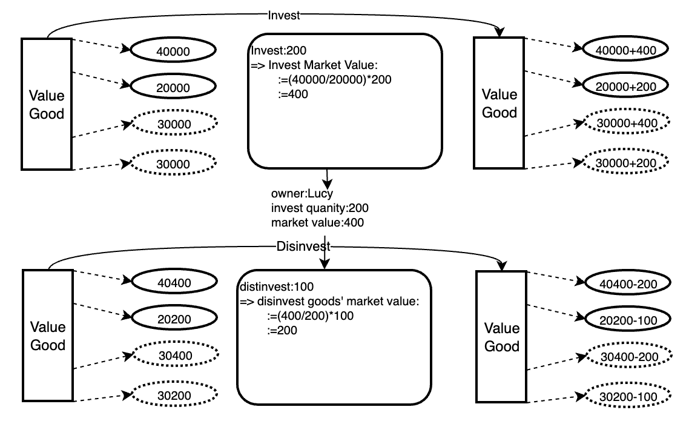
* User Invests in Valued goods:
Users calculate the market value corresponding to the investment quantity based on the current status of valued goods. This facilitates profit calculation when withdrawing investments.
* User Withdraws from Valued goods:
Users calculate the profits generated from investments based on investment records.
When withdrawing from goods, the canceled quantity or the canceled market value corresponding to the quantity needs to be less than the total current quantity or the total value divided by the maximum withdrawal ratio.
## 6.3 Invest normal good
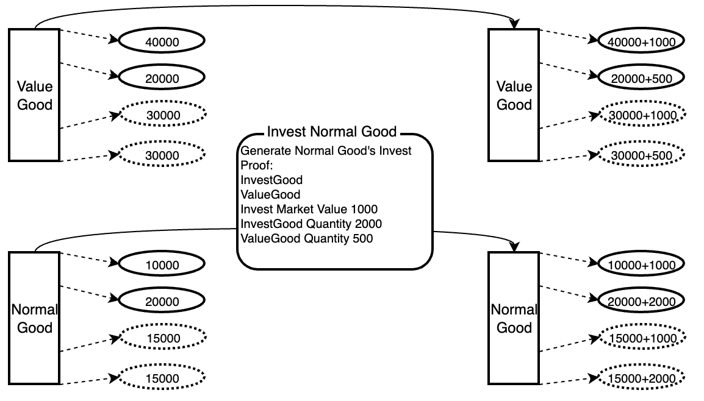!
* User Invests in Regular goods:
Due to the volatile market value of regular goods, it is easy to form arbitrage against other users' tokens on the platform. To avoid this situation, it is necessary to invest in valued goods with comparable market values. Both valued goods and regular goods generate investment returns, as detailed in the fee distribution.
## 6.4 Disinvest normal good

* User Invests in Regular goods:
Due to the volatile market value of regular goods, it is easy to form arbitrage against other users' tokens on the platform. To avoid this situation, it is necessary to invest in valued goods with comparable market values. Both valued goods and regular goods generate investment returns, as detailed in the fee distribution.
---

# 7 Good's fee
## 7.1 Record good's fee

* Noun explanations:
Total fees refer to the sum of actual transaction fees generated and construction fees.
Construction fees are virtual fees introduced to calculate the profits generated from user investments, but they are not actual transaction fees. For more details, please refer to Sections 7.4 and 7.5.
## 7.2 Fee source
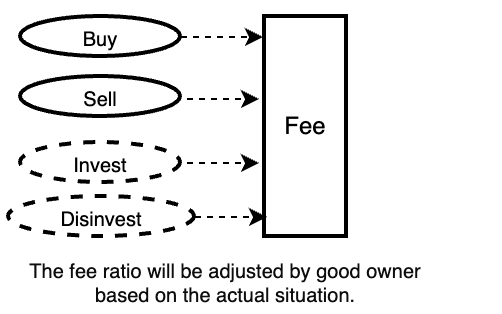
The source of transaction fees (actual transaction fees) is calculated based on the fee rate of goods when users perform operations.
## 7.3 Fee allocate

The platform involves platform technology, portal operation, referrers, users, and liquidity providers. The platform will distribute profits reasonably.
The fee distribution for liquidity providers can be found in Section 7.4, Fee Process.

* If users fill in a referrer:
The allocation for each role is recorded in real-time.
* If users do not fill in a referrer:
The proportion held by users is allocated to merchants.
The proportion held by referrers is allocated to the portal.
___
## 7.4 Fee compute flow(invest)

* diagram 1
Unit fee refers to how much fee each unit of investment should receive, calculated as the total fee amount divided by the total investment quantity. As transactions progress, fees continuously generate, leading to an increase in the total fee amount, and consequently, an increase in the unit fee.
The construction fee is introduced at the beginning of user investment to record the total fee amount that users should not enjoy. It is calculated as the investment quantity multiplied by the unit fee at the time of investment.

* diagram 2
When fees continue to generate within the platform, the unit fee will continuously increase.
The profit generated from user investments is calculated as follows: Profit = (Unit fee X Investment quantity) - Construction fee.

* diagram 3
When users make multiple investments in the same good, they can consolidate them into a single investment record.
The consolidated construction fee after merging equals the sum of the construction fees before merging.
The profit generated from user investments is calculated as follows: Profit = (Unit fee X Investment quantity) - Consolidated construction fee.

* diagram 4
The diagram illustrates the consolidated investment situation.

* diagram 5
When multiple users invest, it can be aggregated into the total investment quantity, total investment market value, and total construction fee for this good.
The total actual investment profit for this good at present equals the current total fees minus the aggregated construction fees.

## 7.5 Fee compute flow(disinvest)

* diagram 1
  When users withdraw their investments, the profit gained equals (Unit fee X withdrawal quantity) - (Construction fee X (withdrawal quantity / total investment quantity)).
* diagram 2
  The profit and construction fee incurred when subtracting user withdrawals from the good.
---

# 8 Market config
| id  | config        | size | unit        | max | min | start | end | note |
| --- | ------------- | ---- | ----------- | --- | --- | ----- | --- | ---- |
| 1   | good investor | 6    | One percent | 63  | 0   | 256   | 251 |      |
| 2   | good seller   | 6    | One percent | 63  | 0   | 250   | 245 |      |
| 3   | gater         | 6    | One percent | 63  | 0   | 244   | 239 |      |
| 4   | referer       | 6    | One percent | 63  | 0   | 238   | 233 |      |
| 5   | customer      | 6    | One percent | 63  | 0   | 232   | 227 |      |
| 6   | plat          | 6    | One percent | 63  | 0   | 226   | 221 |      |
| ... |               |      |             |     |     |       |     |      |

---

# 9 Main code implementation (see code for details) 

# 9.1 Deploy Contract gas
| Deployment Cost | Deployment Size |
| --------------- | --------------- |
| 5144500         | 25351           |

# 9.2 Function(main function)GAS 

| Function Name        | min    | avg    | median | max    | note |
| -------------------- | ------ | ------ | ------ | ------ | ---- |
| buyGood              | 51373  | 138059 | 60565  | 329943 |      |
| disinvestNormalGood  | 61544  | 128844 | 124744 | 204344 |      |
| disinvestNormalProof | 60921  | 128221 | 124121 | 203721 |      |
| disinvestValueGood   | 38356  | 73889  | 91656  | 91656  |      |
| disinvestValueProof  | 40516  | 92016  | 97816  | 126116 |      |
| initNormalGood       | 332431 | 359376 | 356331 | 405431 |      |
| investNormalGood     | 60628  | 122094 | 113028 | 192628 |      |
| investValueGood      | 40648  | 116896 | 155177 | 279577 |      |
| setMarketConfig      | 1125   | 1125   | 1125   | 1125   |      |
| updateGoodConfig     | 3098   | 3098   | 3098   | 3098   |      |

# 10 Platform Token
  The platform adopts a 4C growth-oriented community token construction scheme. Through this scheme, the platform's growth is more flexible and promoted. The dual-token model will continue to be refined.

## 10.1 4C Growth-Oriented Community Token Governance Development Plan
4C Growth Community Token Roles are divided into four categories: Founders, Partners, Value Contributors, and Capital Contributors.
1. Founder Portion:
The founder portion is held solely by the project initiator, who provides a significant amount of human capital to develop products, establish brand identity, expand the market, recruit talent, and establish management systems, while also bearing significant risks. Founders enjoy control, decision-making power, and profit-sharing rights. (Not subject to forced buyback upon resignation, 60-month quarterly unlocking after 12 months online. At the end of the unlocking period, controlled by the community account, and the owner also has voting and profit-sharing rights over this portion)
2. Partner Roles (Partner Portions A and Partner Portions B):
As initial project partners, they utilize their team's strong execution capabilities to overcome various challenges and believe in expanding and strengthening the community without resources. The original partners evenly distribute control, decision-making power, and profit-sharing rights. (Partner Portion A is not subject to forced buyback upon resignation, while Partner Portion B is subject to forced buyback upon resignation, with 36-month quarterly unlocking after 6 months online. At the end of the unlocking period, controlled by the community account, and the owner also has voting and profit-sharing rights over this portion)
3. Value Contribution:
Divides profit-sharing rights based on the value provided to the community. Voting rights for this portion are held by the founders. Adjustments to position portions, employee options portions, and other portions are made according to circumstances.
* Community Position Portions:
The portion of positions is determined by the importance of positions in the community. This portion is allocated to individuals responsible for important community positions, and the proportion corresponding to important positions is determined by the community at the beginning of each year. After being qualified and excellent, individuals responsible for important positions can convert a certain proportion into Partner Portions A and Partner Portions B through community decisions. The profit-sharing rights of position portions are enjoyed by the responsible individuals, control is controlled by the community account, and decision-making power is held by the founders. (When resigning, the community will buy back the Partner Portion B, and if the community does not repurchase it, the Partner Portion B will automatically convert to Partner Portion A. It is a position share and will be recovered by the community upon resignation, and is locked by the community)
* Community Member Option Portions:
Reserved for incentivizing employees to work together for the community. After being qualified and excellent, outstanding employees can convert a certain proportion into Partner Portion B through community decisions, control is controlled by the community account, decision-making power is held by the founders, and profit-sharing rights are enjoyed by employees. (When resigning, the community will recover this portion, and it is locked by the community)
* Other Portions:
Used for treasury, operations, events, advisory, etc.
4. Capital Contribution:
* Crowdfunding Portion (See Crowdfunding Plan):
Provides financial support for team building, product development, and liquidity development.
* Airdrop Portion:
To compensate for early user risks on the platform.
* Investment Portion:
Provides financial support for team advancement, product improvement, etc.

Throughout the process, as more capital enters, it is ensured through issuance. Additionally, the community will also ensure profit sharing through buybacks or dividends.

## 10.2 Design of 4C Growth-Oriented Community Token Allocation Guidelines

Note:

1. The unlocked portion of all roles is held by the community account.
2. At the end of each quarter, transfers are made based on actual circumstances.
3. The value contribution portion is only entitled to dividend rights for the corresponding individuals, with no control or ownership rights. Depending on the team's achievement of goals, a portion may be converted into Partner-A or Partner-B shares.
4. Voting rights for holdings in the community account are controlled by the project founders.

## 10.3 TTS Token Issuance Guidelines.

The equity tokens enjoy community dividend rights and asset ownership.
Total issuance: 1 billion tokens.

# 11 Legal License
## 11.1 Description
To uphold the proper rights of the project and facilitate understanding of the agreements by other users, different files are governed by different open-source licenses. Violations of these agreements may result in legal consequences.
## 11.2 Protocol Description
Documents using the MIT license are freely available for everyone to use.

Documents using the BUSL-1.1 license can only be used for learning purposes within the term of the agreement and cannot be used for commercial purposes. For specific terms of the agreement, please refer to the LICENSE file in the project or on GitHub: https://github.com/ttswap/ttswap-core/LICENSE. If the project inadvertently violates other open-source licenses, please contact us immediately, and we will make adjustments promptly.
## 11.3 Open Source License Information
├── GoodManage.sol(BUSL-1.1)
├── MarketManager.sol(BUSL-1.1)
├── ProofManage.sol(BUSL-1.1)
├── interfaces
│   ├── I_Good.sol(MIT)
│   ├── I_MarketManage.sol(MIT)
│   └── I_Proof.sol(MIT)
├── libraries
│   ├── Address.sol(MIT)
│   ├── FullMath.sol(MIT)
│   ├── L_Good.sol(BUSL-1.1)
│   ├── L_GoodConfig.sol(BUSL-1.1)
│   ├── L_MarketConfig.sol(BUSL-1.1)
│   ├── L_Proof.sol(BUSL-1.1)
│   ├── L_Ralate.sol(MIT)
│   ├── Multicall.sol( GPL-2.0-or-later)
│   ├── SafeCast.sol (MIT)
│   └── Strings.sol (MIT)
└── types
    ├── S_GoodKey.sol(MIT)
    ├── S_ProofKey.sol(MIT)
    ├── T_BalanceUINT256.sol(MIT)
    ├── T_Currency.sol(MIT)
    ├── T_GoodId.sol(MIT)
    └── T_ProofId.sol(MIT)

# 12 contract 
X:@ttswap_exchange   
TG:@ttswap01   
Email:ttswap.exchange@gmail.com   
Discord:https://discord.com/invite/GZyEPZmk 
 
